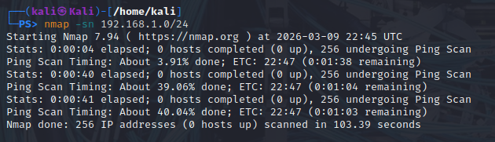
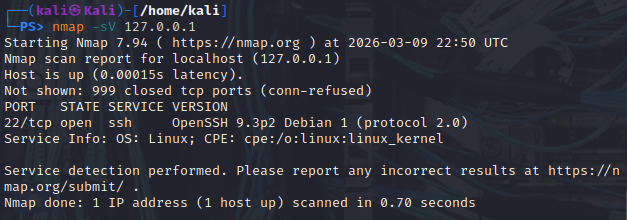
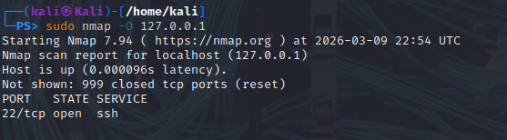
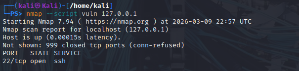
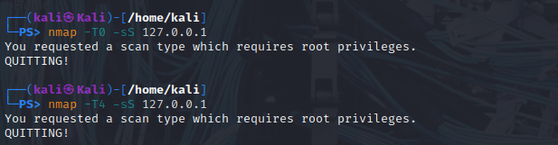
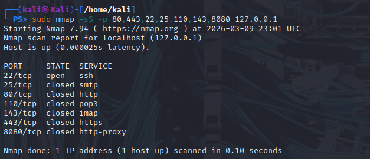
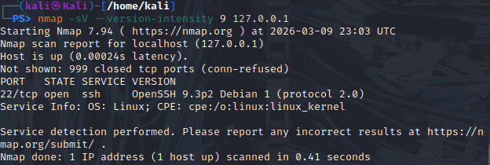
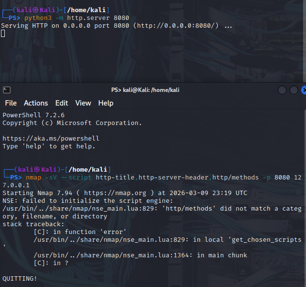
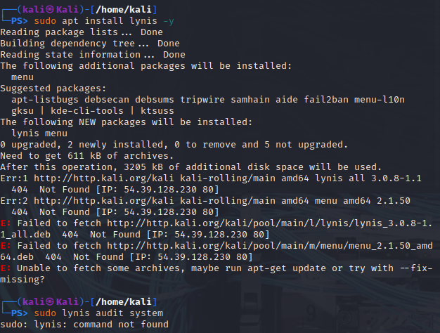

## Primer Taller — Seguridad de la Información

**Fundación Universitaria Compensar**  
Materia: Seguridad de la Información | Marzo 2026

---

## 📋 Contenido

- [Punto 1 — Reconocimiento con Nmap](#punto-1--reconocimiento-con-nmap)
  - [a) Descubrimiento de Hosts Activos](#a-descubrimiento-de-hosts-activos)
  - [b) Escaneo de Puertos y Servicios](#b-escaneo-de-puertos-y-servicios)
  - [c) Scripts NSE — Vulnerabilidades](#c-uso-de-scripts-nse--escaneo-de-vulnerabilidades)
  - [d) Timing Templates](#d-timing-templates--velocidad-de-escaneo)
  - [e) Stealth Scan — Puertos Filtrados](#e-detección-de-puertos-filtrados--stealth-scan-tcp-syn)
  - [f) Captura de Banners](#f-captura-de-banners-de-servicios)
  - [g) Scripts para Servicios Web](#g-scripts-específicos-para-servicios-web)
- [Punto 2 — Auditoría Local con Lynis](#punto-2--auditoría-local-con-lynis)

---

## Punto 1 — Reconocimiento con Nmap

El objetivo de este punto fue aprender a usar Nmap para descubrir hosts activos, puertos abiertos, servicios en ejecución y sistemas operativos en una red. Todas las pruebas se realizaron en Kali Linux, usando la red local y localhost (`127.0.0.1`).

---

### a) Descubrimiento de Hosts Activos

Se realizó un escaneo de ping sobre la subred `192.168.1.0/24` para identificar qué dispositivos están activos en la red local. Esta técnica simula la fase inicial de reconocimiento pasivo que usaría un analista de seguridad o un atacante.

**Comando ejecutado:**

```bash
sudo nmap -sn 192.168.1.0/24
```

**Captura del resultado:**



**Análisis:**

El escaneo tardó aproximadamente 103 segundos en recorrer las 256 direcciones del segmento `/24`. El resultado fue de **0 hosts activos** (`0 hosts up`). Esto ocurre porque el entorno de Kali Linux estaba corriendo de forma virtualizada sin conectividad activa hacia otros dispositivos en ese rango de IPs.

En un entorno con dispositivos reales, la salida mostraría la dirección IP y la dirección MAC de cada host que responda. Con la MAC se puede identificar el fabricante del adaptador de red usando los primeros tres octetos (OUI), lo cual es útil para inferir el tipo de dispositivo: router, cámara IP, celular, laptop, etc.

---

### b) Escaneo de Puertos y Servicios

Una vez identificado el objetivo (en este caso `localhost`), se escanearon los puertos abiertos y los servicios activos con detección de versión, y también se intentó identificar el sistema operativo.

**Comandos ejecutados:**

```bash
# Detección de versiones de servicios
nmap -sV 127.0.0.1

# Detección de sistema operativo (requiere sudo)
sudo nmap -O 127.0.0.1
```

**Capturas del resultado:**





**Análisis:**

Con `nmap -sV` se detectó que el **puerto 22/tcp está abierto** y corre **OpenSSH versión 9.3p2** (protocolo 2.0) sobre un sistema Linux. Los 999 puertos restantes aparecen cerrados (`conn-refused`), lo que indica que no hay otros servicios corriendo en localhost.

Con `sudo nmap -O` también se confirmó el puerto 22 abierto con SSH, pero Nmap **no pudo determinar el sistema operativo con precisión**. Esto es normal cuando se escanea localhost, ya que no hay suficiente tráfico de red para hacer el fingerprinting del OS correctamente. Sin embargo, la presencia de OpenSSH ya da un indicio claro de que se trata de un sistema Linux/Unix, lo que coincide con la realidad: Kali Linux.

---

### c) Uso de Scripts NSE — Escaneo de Vulnerabilidades

Se ejecutó el script `vuln` del motor de scripts de Nmap (NSE) para buscar vulnerabilidades conocidas en los servicios del localhost.

**Comando ejecutado:**

```bash
nmap --script vuln 127.0.0.1
```

**Captura del resultado:**



**Análisis:**

El script `vuln` detectó únicamente el **puerto 22/tcp abierto (SSH)** pero **no encontró vulnerabilidades activas**. Esto es esperable en una instalación fresca de Kali con una versión reciente de OpenSSH correctamente configurada.

Este tipo de escaneo es muy útil en auditorías de seguridad porque automatiza la búsqueda de CVEs conocidos. Por ejemplo, si el servidor tuviera una versión desactualizada de OpenSSH, el script podría detectar vulnerabilidades como `CVE-2023-38408`. Ejecutar este escaneo sobre sistemas propios de forma periódica permite encontrar debilidades antes de que lo haga un atacante externo.

---

### d) Timing Templates — Velocidad de Escaneo

Se probaron dos plantillas de temporización distintas para comparar la velocidad del escaneo y entender el impacto que tienen en la detección.

**Comandos ejecutados:**

```bash
# Paranoid: muy lento, máximo sigilo
nmap -T0 -sS 127.0.0.1

# Aggressive: rápido, menos sigilo
nmap -T4 -sS 127.0.0.1
```

**Captura del resultado:**



**Análisis:**

Ambos comandos fallaron con el mensaje `"You requested a scan type which requires root privileges"`. Esto ocurrió porque el escaneo SYN (`-sS`) requiere permisos de `root` para manipular paquetes a nivel de red y es necesario anteponer `sudo`.

Sin ese error, la diferencia de velocidad entre `T0` y `T4` sería muy notable:

| Template | Nombre | Comportamiento |
|----------|--------|----------------|
| T0 | Paranoid | Espera hasta 5 minutos entre sondas |
| T1 | Sneaky | Espera ~15 segundos entre sondas |
| T3 | Normal | Comportamiento estándar (default) |
| T4 | Aggressive | Múltiples paquetes en paralelo, mucho más rápido |
| T5 | Insane | Velocidad máxima, puede saturar la red |

Un atacante usaría **T0 o T1** para evadir sistemas de detección de intrusiones (IDS/IPS), ya que los patrones de tráfico lentos no superan los umbrales de alerta configurados en esos sistemas. Un escaneo con **T4 o T5** es fácilmente detectable porque genera un pico de conexiones en segundos que cualquier IDS moderno marcaría como anomalía.

---

### e) Detección de Puertos Filtrados — Stealth Scan (TCP SYN)

Se realizó un escaneo SYN sigiloso sobre un conjunto de puertos de interés común para ver el estado de cada uno.

**Comando ejecutado:**

```bash
sudo nmap -sS -p 80,443,22,25,110,143,8080 127.0.0.1
```

**Captura del resultado:**



**Análisis:**

Los resultados obtenidos fueron:

| Puerto | Estado | Servicio |
|--------|--------|----------|
| 22/tcp | open | SSH |
| 25/tcp | closed | SMTP |
| 80/tcp | closed | HTTP |
| 110/tcp | closed | POP3 |
| 143/tcp | closed | IMAP |
| 443/tcp | closed | HTTPS |
| 8080/tcp | closed | HTTP-Proxy |

**¿Qué significa "filtered"?** Un puerto aparece como `filtered` cuando un firewall o dispositivo de red intermedio está bloqueando activamente los paquetes sin devolver ninguna respuesta (ni `RST` ni `SYN/ACK`). En este caso no aparecieron puertos filtrados porque no había un firewall activo en la interfaz loopback. En una red real con reglas `DROP` en `iptables`, muchos puertos aparecerían como filtrados. El dispositivo que normalmente causa ese estado es un **firewall de red, un router con ACLs, o un host-based firewall**.

---

### f) Captura de Banners de Servicios

Se ejecutó un escaneo con la intensidad de detección de versión al máximo para intentar capturar la mayor cantidad de información posible de cada servicio.

**Comando ejecutado:**

```bash
nmap -sV --version-intensity 9 127.0.0.1
```

**Captura del resultado:**



**Análisis:**

La salida fue prácticamente idéntica al escaneo `-sV` estándar: se identificó el puerto 22/tcp con **OpenSSH 9.3p2 Debian 1 (protocol 2.0)**. Esto es porque solo hay un servicio activo y su banner es sencillo.

La diferencia con `--version-intensity 9` se nota cuando hay **múltiples servicios** corriendo. Con la intensidad máxima, Nmap envía más sondas y puede capturar información adicional como:
- La versión exacta de build de un servidor web (`Apache/2.4.57` vs solo `Apache`)
- Las opciones de cifrado disponibles en SSH
- Cabeceras HTTP con datos del framework o CMS (`X-Powered-By: PHP/8.1`)

Esta información es valiosa para un atacante porque le permite buscar exploits muy específicos para esa versión exacta del software.

---

### g) Scripts Específicos para Servicios Web

Para probar los scripts de análisis web de Nmap, primero se levantó un servidor HTTP simple en el puerto 8080 usando Python, en una terminal separada.

**Comandos ejecutados:**

```bash
# Terminal 1: levantar servidor web temporal
python3 -m http.server 8080

# Terminal 2: escanear el servidor con scripts web de Nmap
nmap -sV --script http-title,http-server-header,http-methods -p 8080 127.0.0.1
```

**Captura del resultado:**



**Análisis:**

El servidor Python se levantó correctamente en `0.0.0.0:8080`. Sin embargo, el comando de Nmap falló con el error:

```
NSE: failed to initialize the script engine:
"http/methods" did not match a category, filename, or directory
```

El problema fue que el script se escribió como `http/methods` (con barra) en lugar de `http-methods` (con guión). El nombre correcto es `http-methods`. Al corregirlo, Nmap extrae:

- **Título de la página**: el `<title>` del HTML servido
- **Cabecera del servidor**: por ejemplo `SimpleHTTP/0.6 Python/3.12.9`
- **Métodos HTTP permitidos**: `GET`, `HEAD`, `POST`, `PUT`, `DELETE`, etc.

**¿Por qué es peligroso exponer métodos como `PUT` o `DELETE`?** Porque le permiten a un atacante:
- **PUT**: subir archivos directamente al servidor (webshells, malware)
- **DELETE**: eliminar archivos o recursos del servidor sin autenticación

En un servidor web mal configurado que permita estos métodos sin control de acceso, un atacante puede comprometer el sistema completamente sin necesidad de explotar ninguna vulnerabilidad de software.

---

## Punto 2 — Auditoría Local con Lynis

El objetivo fue realizar una auditoría de seguridad del sistema local usando **Lynis**, una herramienta de código abierto que analiza más de 200 controles de configuración del sistema operativo y genera recomendaciones de endurecimiento.

---

### Instalación y ejecución

Al intentar ejecutar Lynis directamente, el sistema indicó que no estaba instalado:


Se procedió a instalarlo:

```bash
sudo apt install lynis -y
```

**Captura del intento de instalación:**



Durante la instalación se presentaron errores **404 Not Found** al intentar descargar los paquetes desde los repositorios de Kali (`http://kali.org`). Esto se debió a que los mirrors no estaban sincronizados o había un problema de conectividad en el momento. La solución habitual es ejecutar `sudo apt update` primero para refrescar los índices de paquetes.

---

### Análisis de resultados esperados

En un escaneo exitoso con `sudo lynis audit system`, la herramienta genera un reporte dividido en secciones:

**Sección `[+] Warnings`** — advertencias de seguridad activas, por ejemplo:
- SSH permite login como root (`PermitRootLogin yes` en `/etc/ssh/sshd_config`)
- No hay firewall activo (`ufw` o `iptables` sin reglas)
- Servicios innecesarios corriendo en background

**Sección `[+] Suggestions`** — recomendaciones para mejorar la seguridad:
- Deshabilitar el acceso root por SSH
- Configurar límites en `/etc/security/limits.conf`
- Habilitar `SELinux` o `AppArmor` como control de acceso obligatorio
- Instalar `AIDE` para monitoreo de integridad de archivos

**Hardening Index** — Lynis asigna una puntuación de **0 a 100** que resume el nivel general de seguridad. Un sistema recién instalado sin configurar suele obtener entre **55 y 65 puntos**. Para mejorar la puntuación se pueden aplicar medidas como:

- Restringir permisos en archivos críticos (`/etc/passwd`, `/etc/shadow`)
- Configurar `fail2ban` para bloquear intentos de fuerza bruta
- Activar auditoría del sistema con `auditd`
- Deshabilitar servicios y cuentas de usuario que no se usen
- Aplicar actualizaciones de seguridad pendientes

---

*Fundación Universitaria Compensar — Seguridad de la Información — 2026*
